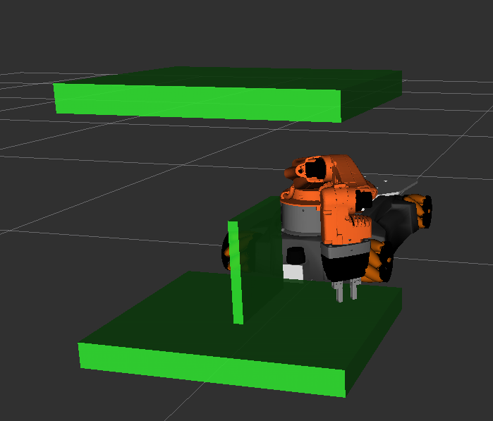

# **Проверка системы управления манипулятором youbot по TCP**



## Оглавление

- [Цель](#цель)
- [Версия операционной системы и необходимые зависимости](#версия-операционной-системы-и-необходимые-зависимости)
- [Установка](#установка)
- [Описание каталогов](#описание-каталогов)
- [О контейнере Docker](#о-контейнере-docker)
- [Порядок запуска файлов](#порядок-запуска-файлов)

---

# Цель

Оценить эффективность различных алгоритмов планирования движения манипулятора на основе случайной выборки, исследовать влияние среды на время планирования и другие метрики.

---
#  Версия операционной системы и необходимые зависимости

- [Оглавление](#оглавление)

| Параметр                        | Значение         |
|---------------------------------|------------------|
| Версия операционной системы     | Ubuntu 22.04     |
| Версия ROS2                     | Humble           |

| Пакеты                          | 
|---------------------------------|
| ros-humble-ros2-control  |
| ros-humble-graph-msgs  |
| ros-humble-rviz-visual-tools  |
| ros*controller*  |
| ros-humble-xacro  |
| ros-humble-robot-state-publisher  |
| ros-humble-joint-state-publisher  |
| ros-humble-moveit  |
| ros-humble-joint-state-publisher-gui  |

---
#  Установка

- [Оглавление](#оглавление)

После загрузки выполните следующие команды для загрузки образа в Docker регистр:

```bash
docker load -i youbot.tar
```

3. Сборка образа самостоятельно

Если вы хотите собрать образ из исходного кода, используйте подготовленный скрипт сборки. Для этого выполните:
```bash
bash img_build.sh
```
После завершения сборки образ будет готов к использованию.

---
#  Описание каталогов

- [Оглавление](#оглавление)

В [youbot_description](./src/youbot_description) находятся конфигурационные файлы, описание модели мобильной платформы.

В [youbot_moveit](./src/youbot_moveit) находится система управления манипулятором мобильного робота.

---
# О контейнере Docker

- [Оглавление](#оглавление)

Контейнер запускается с графической поддержкой и автоматическим выбором случайного ROS_DOMAIN_ID. Используется для работы с RViz и MoveIt для визуализации и планирования движения манипулятора.

Параметры запуска контейнера описаны в скрипте cont_build.sh:

В этом скрипте используются следующие флаги:
```bash
docker run --name youbot -it --net=host \
  --env "QT_X11_NO_MITSHM=1" \
  --env DISPLAY=unix$DISPLAY \
  --env ROS_DOMAIN_ID="$RANDOM_DOMAIN_ID" \
  --volume "$(pwd):/youbot" \
  --privileged \
  --volume /tmp/.X11-unix:/tmp/.X11-unix \
  youbot_task \
  -c ". /opt/ros/humble/setup.bash; cd /youbot; colcon build; bash runlaunch.sh"
```
`--name youbot`: задаёт имя контейнера как spam. Это позволяет легко идентифицировать контейнер и ссылаться на него в дальнейших командах.

`--runtime=nvidia`: указывает, что контейнер должен использовать NVIDIA-совместимую среду выполнения. Этот флаг необходим для работы с GPU с помощью контейнера.

`--gpus all`: выделяет все доступные GPU для контейнера. Чтобы ограничить использование конкретных GPU, можно указать их идентификаторы.

`--privileged`: запускает контейнер с привилегированными правами, что дает ему доступ к устройствам и некоторым системным ресурсам хоста. Это необходимо, если контейнеру нужны расширенные возможности, такие как доступ к устройствам, USB или сетевым интерфейсам.

`-it`: сочетание флагов -i (interactive) и -t (tty). Первый сохраняет стандартный ввод контейнера открытым, второй предоставляет виртуальный терминал для взаимодействия с контейнером через командную строку.

`--rm`: удаляет контейнер после завершения его работы. Это предотвращает накопление остановленных контейнеров.

`--net=host`: этот флаг указывает, что контейнер должен использовать сетевую конфигурацию хоста. Это означает, что контейнер будет иметь доступ к тем же сетевым интерфейсам, что и хост, и будет слушать на тех же портах, что и хост.

`--env="QT_X11_NO_MITSHM=1"`: устанавливает переменную окружения QT_X11_NO_MITSHM=1, которая отключает использование MIT-SHM (shared memory) в X11 для приложений, использующих Qt. Это нужно для корректной работы Qt-приложений в контейнере с X11.

`--env DISPLAY=unix$DISPLAY`: устанавливает переменную окружения DISPLAY, указывающую контейнеру, какой дисплей использовать. Значение unix$DISPLAY указывает на использование текущего X-сервера хоста.

`--volume /tmp/.X11-unix:/tmp/.X11-unix`: монтирует директорию /tmp/.X11-unix с хоста в контейнер. Эта директория используется X11 для связи с дисплеем. Монтирование нужно для того, чтобы контейнер мог выводить графику на экран хоста.

`youbot_task`: указывает на образ Docker, который будет запущен. В данном случае, это образ с именем youbot_task.

После запуска контейнера его можно [остановить](./stop_cont.sh) или [запустить заново](./run_cont.sh).

Для открытия дополнительного окна контейнера можно воспользоваться [скриптом](./terminal.sh).

---
#  Порядок запуска файлов

- [Оглавление](#оглавление)

1. Запустить визуализацию RViz и сборку проекта:
```bash
bash cont_build.sh
```

##############################################################
